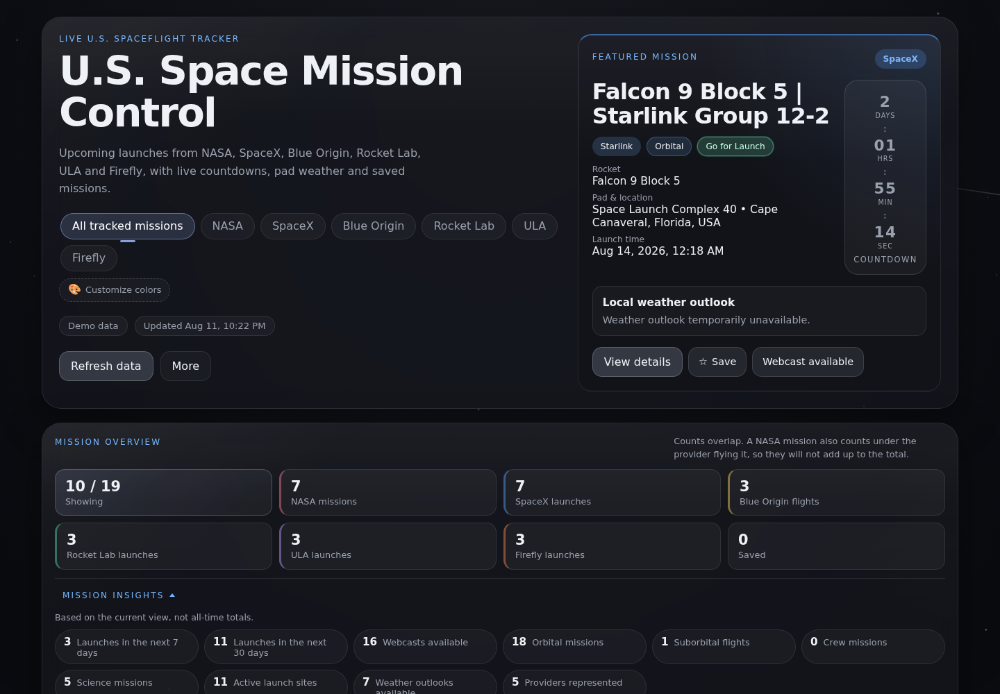
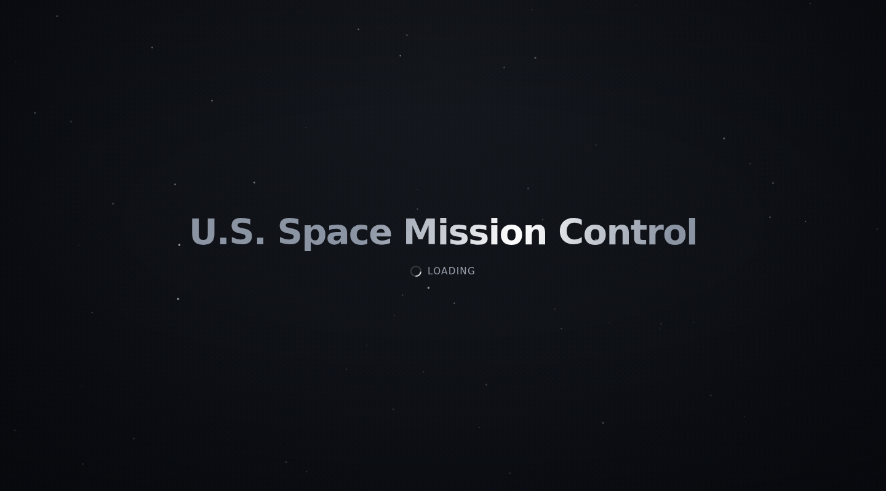
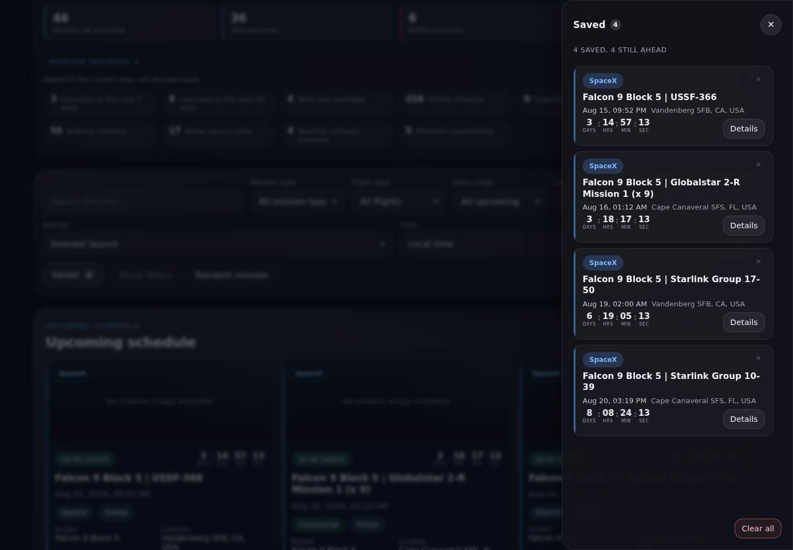
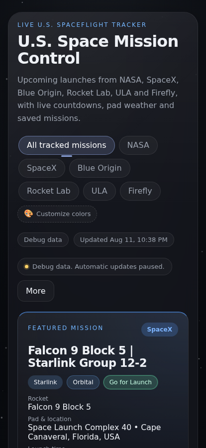

# U.S. Space Mission Control

A U.S. spaceflight dashboard built with plain HTML, CSS and JavaScript. It
tracks upcoming launches from NASA, SpaceX, Blue Origin, Rocket Lab, ULA and
Firefly with live countdowns, pad weather, filters and saved missions.

Live site: <https://dawsoncodes.github.io/US-Space-Mission-Control/>

No framework, no build step, no dependencies. What you see is what ships.

## Screenshots



The startup sequence, before the title flies into the hero.



Saved missions, soonest first. The coloured edge on each card is the
organization flying it, split into a band each when two share a mission.



The layout on a phone.



## How the organizations work

NASA is an agency. SpaceX, Blue Origin, Rocket Lab, ULA and Firefly are launch
providers. A NASA payload usually flies on someone else's rocket, so it shows up
under NASA and under the provider flying it. That means the organization counts
overlap on purpose and will not add up to the total.

Cards carry a coloured edge showing whose launch it is. When two organizations
share a mission the edge splits into a band for each.

## Features

Missions

- Organization tabs and clickable overview tiles for the six tracked
  organizations
- A featured spotlight for the next mission matching your current view
- Mission details with local, UTC and launch-site times, rocket, pad, orbit,
  description, weather, launch probability and a pad map link
- Previous launches with a Success, Partial failure or Failure outcome, the
  published cause when something went wrong, the weather recorded at liftoff,
  and a link to watch the launch back
- Mission insights for the current filtered view, never all-time totals

Finding things

- Search across mission name, rocket, location, status, provider and agency
- Filters for organization, mission type, flight type, date range, launch site
  and orbit
- Sort by soonest, latest, name, launch probability or recently updated
- Ten results at a time with Load more and Show all

Keeping things

- Save any mission to a drawer that survives refreshes and new visits
- Download a calendar file for any launch with a confirmed time
- Copy a shareable link that opens straight to a mission

Presentation

- Local, UTC or launch-site time
- Customizable organization colours saved on your device
- Animated starfield background and a numbered motion system, all of which
  honours `prefers-reduced-motion`
- Responsive from phone to wide desktop
- Accessible overlays with focus trapping, Escape to close and focus
  restoration

Reliability

- Data is published on a schedule, so visitors never call the launch API and
  cannot be rate limited
- Updates itself every 30 minutes and when you return to a backgrounded tab.
  There is no refresh button; the hero shows where the window stands
- Renders saved data instantly, so the dashboard is never empty while it checks
  for an update
- Falls back to calling the API directly if the published data ever goes stale
- A one-feed failure never replaces the complete list with a partial one, in the
  browser or in the published file
- Debug data at the foot of the page loads real missions from the development
  mirror, falling back to bundled samples with no network at all

## How the data gets here

Launch Library 2 allows roughly 15 requests an hour per caller. When every
visitor called it directly that ran out fast, which showed up as partial lists
and outright failures.

So visitors no longer call it. A workflow runs twice an hour, fetches
everything, and commits the result as plain JSON under `data/`. The dashboard
loads those files from its own origin, which means:

- No visitor makes a launch API request, so no one can be rate limited
- Everyone sees the same complete list, not whatever their browser managed to
  fetch before being cut off
- The workflow can page each feed until it is exhausted and retry a feed that
  fails, rather than publishing a partial list

The page re-reads the snapshot every 30 minutes and when you come back to a
backgrounded tab. There is no refresh button. It uses a conditional request, so when nothing has been
published since last time the server answers 304 and no data is transferred.
The workflow likewise commits nothing when the data has not changed.

Calling the API directly is still in the code as a fallback, for a fresh fork, a
local checkout, or a workflow that has stopped running. That path keeps the
rate-limit handling, since it is the only one that can be refused, and it is
rationed: reloading the page never spends a request, and the fallback only
fires when there is nothing to show or what is shown is over an hour old.

The published file is the shared cache. Everyone who opens the page reads the
same one, so the 30-minute cycle applies to everybody rather than per browser.
The copy in `localStorage` exists only so the dashboard paints instantly instead
of showing an empty page while that file loads.

The Space Devs also run a development mirror at `lldev.thespacedevs.com`, meant
for building and testing rather than production traffic. It is not meaningfully
rate limited, and in exchange it serves a cached dataset that can be days out of
date. Debug data at the foot of the page reads from it, and nothing else does.
It is deliberately not a fallback: when one of its feeds comes back short the
result is every NASA mission and nothing else, which must never appear unasked.
It is labelled wherever it appears and is never written to the cache.

Every request is counted. The workflow records what it spent into the snapshot,
and the About panel shows it alongside what this browser has spent, which should
read zero. The workflow will not exceed seven requests per run, which is two
runs an hour against Launch Library's fifteen; if a feed grows past that it stops
paging and reports the list as truncated rather than overspending.

To run the fetch yourself:

```bash
node scripts/fetch-data.mjs
```

Two feeds are fetched, one for the tracked providers and one for NASA-tagged
missions, then merged and de-duplicated by launch id. The result is also cached
in `localStorage` with a schema version, so the dashboard paints instantly on a
repeat visit and is never empty while it checks for an update.

Weather comes from [Open-Meteo](https://open-meteo.com/), which needs no key.
Forecasts are fetched only for the spotlight and the open mission details, not
for every card. Weather recorded at a past launch is fetched once and stored
with that launch. This is not an official launch forecast.

The Previous launches panel keeps a rolling window of the 20 most recent
completed launches. When a provider flies again the new launch enters the top
and the oldest drops off, taking its stored weather with it, so the saved data
cannot grow.

Launch images come from Launch Library 2. When there is none, a neutral
placeholder is shown instead of stand-in artwork. See
[`assets/images/ATTRIBUTION.md`](assets/images/ATTRIBUTION.md).

Pad map links open [OpenStreetMap](https://www.openstreetmap.org/) in a new
tab. Map data © OpenStreetMap contributors. The app makes no map requests
itself.

## Running it locally

The app uses ES modules, so it has to be served over `http://`. Opening the
file directly will not work.

```bash
python3 -m http.server 8000
# then open http://localhost:8000/
```

The test suites are plain Node with no dependencies. CI runs the same ones from
`.github/workflows/validate.yml`.

```bash
node tests/check-project.mjs
for f in tests/*.test.mjs; do node "$f"; done
```

## Project layout

```
index.html            App shell, stays at the repository root
favicon.svg           Inline SVG favicon
styles/
  base.css            Design tokens, reset, typography, starfield, keyframes
  layout.css          Page shell, panels, grids
  components.css      Buttons, tabs, tiles, cards, badges, overlays, status
  responsive.css      Breakpoints and mobile sheets
js/
  config.js           LL2 and Open-Meteo endpoints, storage keys, limits
  state.js            Shared application state
  demo-data.js        Offline missions, always future-dated
  storage.js          Prefs, favorites, manifest cache, key migration
  previous-store.js   Rolling window of completed launches and their weather
  utils.js            Escaping, URL safety, date and countdown formatting
  normalize.js        Launch normalization and merge, shared with the workflow
  api.js              Snapshot loading, API fallback, paging, rate limiting
  organizations.js    Organization, mission type, orbit, site, status, outcome
  images.js           Launch-image resolver
  filters.js          Keyword, date, site, orbit and sorting pipeline
  calendar.js         Calendar file generation
  deeplink.js         Shareable mission links
  status-timer.js     Status-banner countdown state machine
  org-theme.js        Organization colours and saved customization
  customize.js        Colour customization panel
  search-hint.js      Typewriter search hint
  weather.js          Open-Meteo forecast and recorded conditions
  modal.js            Overlay mechanics, focus trap, scroll lock
  render.js           DOM references and all markup
  boot.js             Startup sequence
  starfield.js        Canvas background
  main.js             Composition root, loading, events, wiring
scripts/
  fetch-data.mjs      Builds data/*.json; run by the scheduled workflow
data/
  launches.json       Published upcoming launches, refreshed twice an hour
  previous.json       Published completed launches
assets/screenshots/   README images
tests/                Plain-Node suites, one per behaviour area
.github/workflows/
  validate.yml        CI validation, no package manager
  refresh-data.yml    Fetches and commits the launch data twice an hour
```

## GitHub Pages

The site is served from the repository root under a project path, so every
asset path is relative. Do not use leading-slash paths, and keep `index.html`
at the repository root.

## Background

This started as an AP Computer Science semester final project and earned a
100/100. It has since grown from a SpaceX-only tracker into a broader U.S.
spaceflight dashboard, modularized into ES modules and split stylesheets while
staying framework-free and easy to deploy.

Release history is in [CHANGELOG.md](CHANGELOG.md). Animations are catalogued in
[ANIMATIONS.md](ANIMATIONS.md).

## Contributing

See [CONTRIBUTING.md](CONTRIBUTING.md) for branches, local testing and keeping
the project dependency-free.

## License

[MIT](LICENSE).
